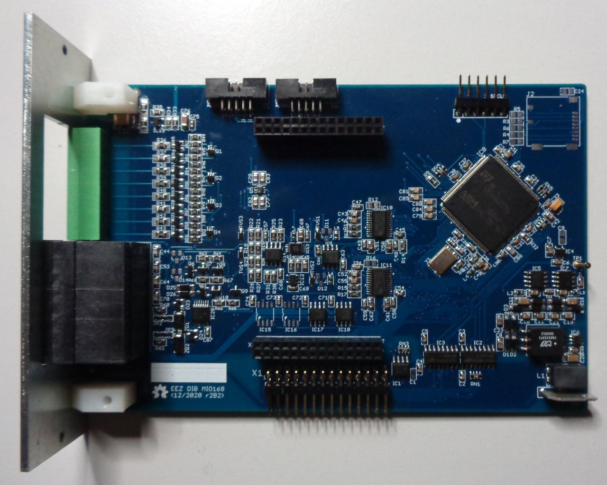

The [EEZ DIB](https://github.com/eez-open/modular-psu) MIO168 module features multiple digital I/O, analog outputs and expansion connectors for carry various AFEs.

### Feature list

* On-board [STM32F446ZCT6](https://www.st.com/content/st_com/en/products/microcontrollers-microprocessors/stm32-32-bit-arm-cortex-mcus/stm32-high-performance-mcus/stm32f4-series/stm32f446/stm32f446zc.html) high-performance foundation line MCU, ARM Cortex-M4 with DSP and FPU, 256 KiB Flash, LQFP-144 package 
* 1 x 8-pin single row 3.81 mm connector (digital inputs)
* 1 x 16-pin dual row 3.81 mm I/O connector (digital and analog outputs)
* 2 x 10-pin ADIB 2.0 mm connectors
* 8 x protected digital inputs (3.3/5/24 V), 2 x fast/slow, 6 x slow
* 8 x digital outputs (low-side) with multiple protections and FAULT detection, 550 mA per channel (current limit 1 A)
* 2 x PWM outputs (protected) or sensor bias power (+/-15 V, max. 10 mA)
* 2 x analog bipolar outputs (+/-5 V, +/-10 V, 0-5 V, 0-10 V). Voltage or current output with protection. 12-bit DAC, replaceable with pin compatible 14- or 16-bit version
* 2 x analog bipolar outputs +/-10 V. 12-bit DAC, replaceable with pin compatible 14- or 16-bit version
* On-board isolated power supply with +/-5.3 V outputs (with 4x multipliers), +/-15 V and +3.3 V LDO
* Firmware download via SPI
* Optional SWD for debugging
* Optional Micro SD card
* I2C EEPROM for storing board specific parameters
* Dimensions: 146 x 95 mm, 4-layer PCB

### r2B2 prototype (without AFE installed)

### Firmware repository

https://github.com/eez-open/dib-mio168-fw  
The firmware download procedure is described in [Chapter 13.2]((https://www.envox.eu/eez-bench-box-3/bb3-user-manual/13-firmware-upgrade/#bb3_man_module_upgrade)) of the User Manual.  
The MIO168 module GUI is described in [Chapter 19](https://www.envox.eu/eez-bench-box-3/bb3-user-manual/19-mio168-mixed-input-output-module/) of the User Manual.
