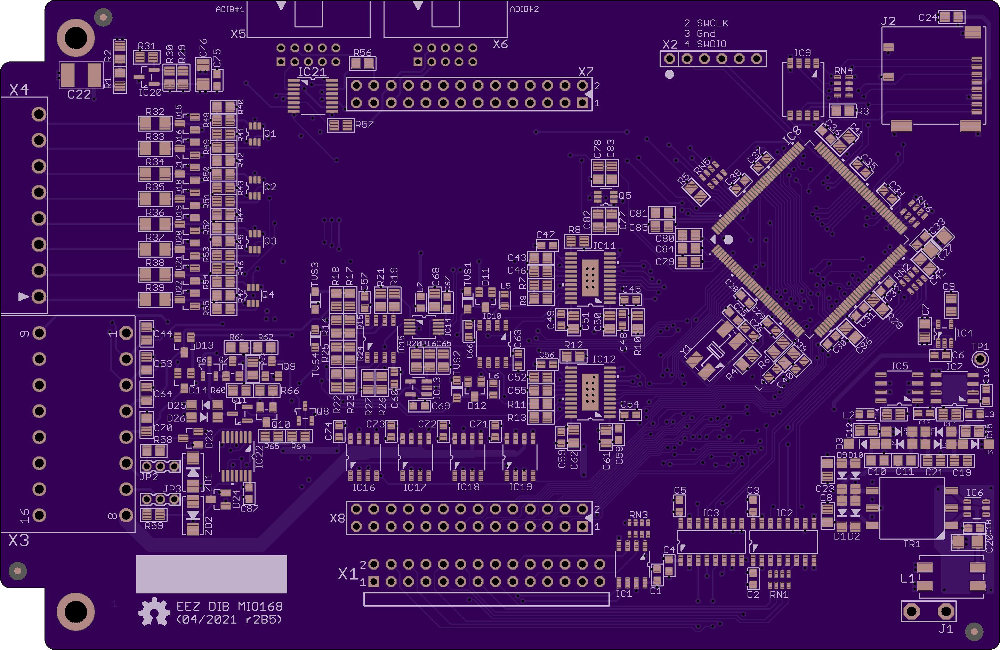

The [EEZ DIB](https://github.com/eez-open/modular-psu) MIO168 module features multiple digital and analog I/O.

### Feature list

* 2 x 16-pin dual row 3.81 mm I/O connectors
* 8 x protected digital inputs (3.3/5/24 V), 2 x fast/slow, 6 x slow
* 8 x digital outputs (low-side) with multiple protections and FAULT detection, 550 mA per channel (current limit 1 A)
* 2 x PWM outputs, protected
* 4 x analog bipolar inputs with protection. Voltage or current selection per channel. 14-bit ADC, replaceable with pin compatible 12- or 16-bit version. Switchable bias for NTC sensors on first two channels
* 2 x analog bipolar outputs (+/-5 V, +/-10 V, 0-5 V, 0-10 V). Voltage or current output with protection. 12-but DAC, replaceable with pin compatible 14- or 16-bit version
* 2 x analog bipolar outputs +/-10 V
* On-board isolated +/-15 V (2W) power supply with +/-12 V, +5 V and +3.3 V LDOs
* STM32F446 MCU
* Firmware download via SPI
* Optional SWD for debugging
* Optional Micro SD card
* I2C EEPROM for storing board specific parameters
* Dimensions: 146 x 95 mm, 4-layer PCB

### PCB r1B1 prototype

